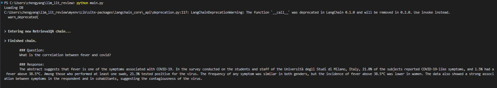
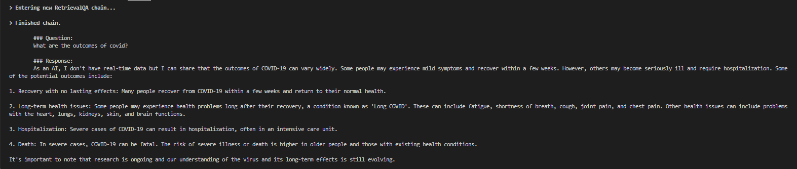

# MedSum
This is an initial MVP for a systematic review and meta analysis tool using LLMs to streamline the workflow of medical researchers.

## How to start

Prerequisties: Make sure you have python and VSCode installed. 
### Step 1:
Run this command in your terminal to clone this repo into your desired folder
```
git clone git@github.com:anchengyang/MedSum.git
```

### Step 2:
Create a virtual environment by running this command in the terminal
```
python -m venv myEnvName
```

### Step 3:
Activate the virtual environment by running this command in the terminal
```
myEnvName/Scripts/Activate.ps1
```
Or if you are on Mac, use
```
source myEnvName/bin/activate
```

### Step 4:
Run this command in your terminal to install the required dependecies
```
pip install -r requirements.txt
```

### Step 5:
Run this command in your terminal to run the main project
```
python main.py
```
The program should be running but i takes awhile to fetch the data, load the data and query the data.

## Example

